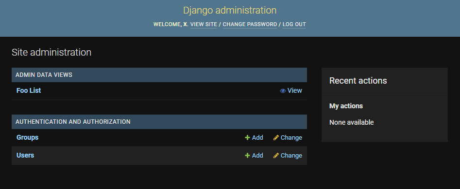
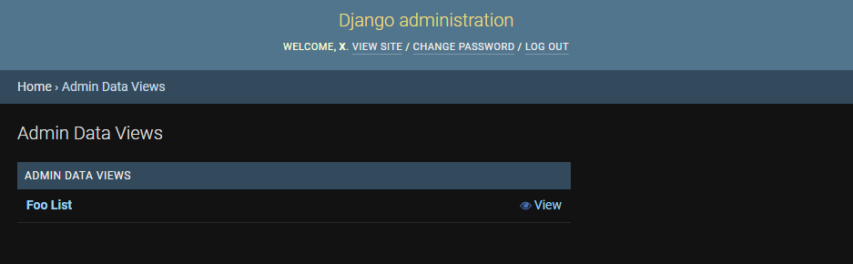
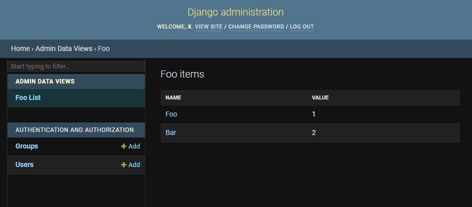
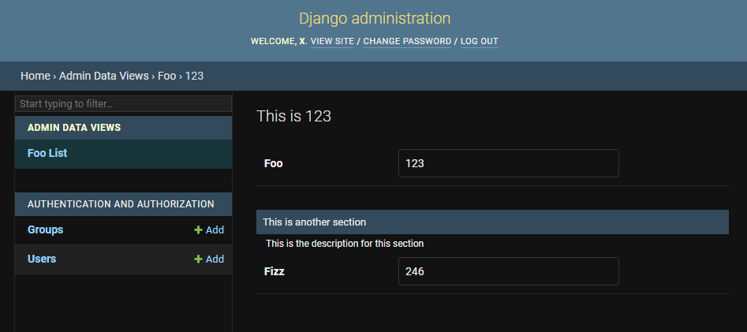

## Setup

① Add `admin_data_views` to installed in `settings.py` apps after `django.contrib.admin`

```python
# project/settings.py

INSTALLED_APPS = [
    ...
    "django.contrib.admin",
    "admin_data_views",
    ...
]
```

② Create data functions

```python
from django.http import HttpRequest
from admin_data_views.typing import TableContext, ItemContext
from admin_data_views.utils import render_with_table_view, render_with_item_view, ItemLink

@render_with_table_view
def foo_list_view(request: HttpRequest) -> TableContext:
    return TableContext(
        title="Foo items",
        subtitle=None,
        table={
            "Name": [ItemLink("Foo", idd=123), ItemLink("Bar", idd=124)],
            "Value": ["1", "2"],
        },
    )

@render_with_item_view
def foo_items_view(request: HttpRequest, idd: int) -> ItemContext:
    return ItemContext(
        slug=idd,
        title=f"This is {idd}",
        subtitle=None,
        image=None,
        data=[
            {
                "name": None,
                "description": None,
                "fields": {
                    "Foo": idd,
                },
            },
            {
                "name": "This is another section",
                "description": "This is the description for this section",
                "fields": {
                    "Fizz": idd * 2,
                },
            },
        ],
    )
```

`render_with_table_view` is used to render the data in a table view.
The view takes a single argument `request`, and must return a dictionary
matching the `TableContext` TypedDict.

`render_with_item_view` is used to render the data in an item view.
The view takes an argument `request` and any number or path arguments,
and must return a dictionary matching the `ItemContext` TypedDict.

`ItemLink` is used to add links to the table view's items' views.
It should be used on the items of the first key in the table.
Additional kwargs can be provided if the item view needs them.

③ Add configuration to project `settings.py`

```python
# project/settings.py

ADMIN_DATA_VIEWS = {
    "NAME": "Admin Data Views",  # Default
    "URLS": [
        {
            "route": "foo/",
            "view": "path.to.function.foo_list_view",
            "name": "foo_list",
            "items": {
                "route": "<int:idd>/",
                "view": "path.to.function.foo_items_view",
                "name": "foo_item",
            },
        },
    ],
}
```

④ Add admin site urls to urlpatterns in project `urls.py`

```python
# project/urls.py
from django.contrib import admin
from django.urls import path

urlpatterns = [path("admin/", admin.site.urls)]
```

⑤ Now the views should be available in the admin panel under the `ADMIN DATA VIEWS` section.










[admin-deps]: https://docs.djangoproject.com/en/dev/ref/contrib/admin/#overview
